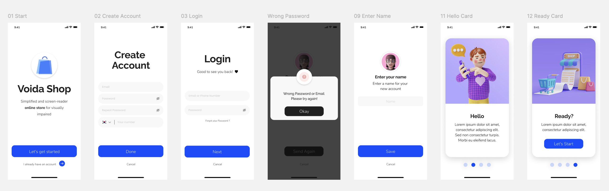

# 🛍️ Voida Shop – Accessibility-Focused UI/UX Design

This repository contains the UI/UX design of **Voida Shop**, a mobile shopping application tailored for **visually impaired users**.  
Our goal is to create a clean, accessible, and user-friendly interface that enables everyone to easily interact with online shopping platforms.

**Branch:** `hw_aliboev`  
**Tool:** Figma  
**Focus:** Accessibility, Minimalism, Inclusivity

---

---

## 🚧 Notes

- This project is a work in progress.
- ✅ Login page is completed.
- 🔨 Shop page is currently in progress.
- 📝 Profile and Settings pages are planned next.
- Additional features and accessibility improvements will be added in upcoming commits.
- Feedback and contributions are always welcome.

---

## 👤 Author

**Abbos Aliboev**  
Computer Science student Chungbuk National University  
Focusing on accessible technology and inclusive design

---

## 🔗 Our Figma Design Link

[Figma Design – Accessibility Login Page](https://www.figma.com/design/Ie71gRLhdyWucS0VDOREHh/Voida----Online-Store-UI-Mobile-App-Design?m=auto&t=eldecDiM1ZFkUBGd-6)

---
