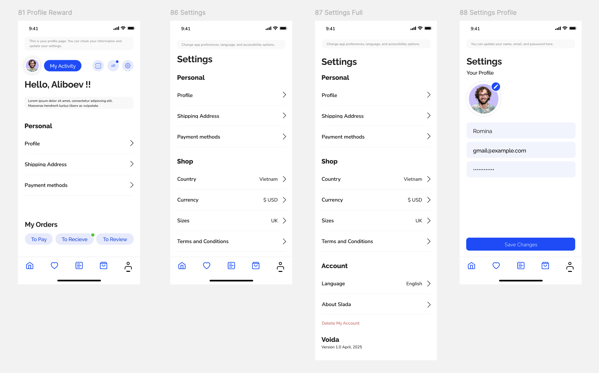
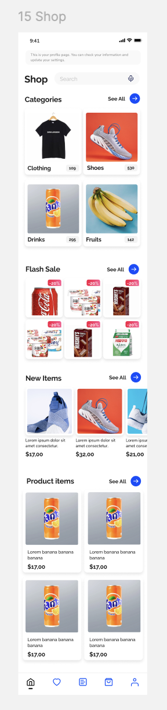
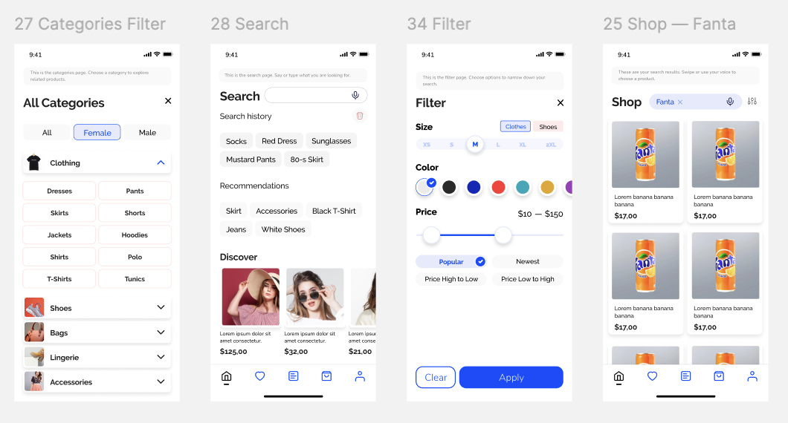
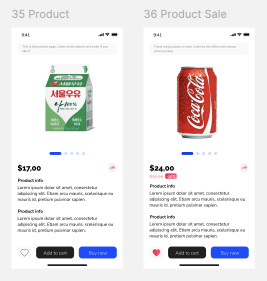
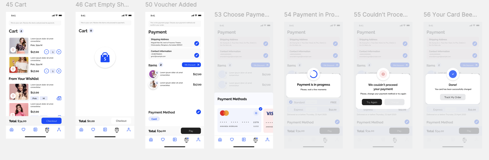
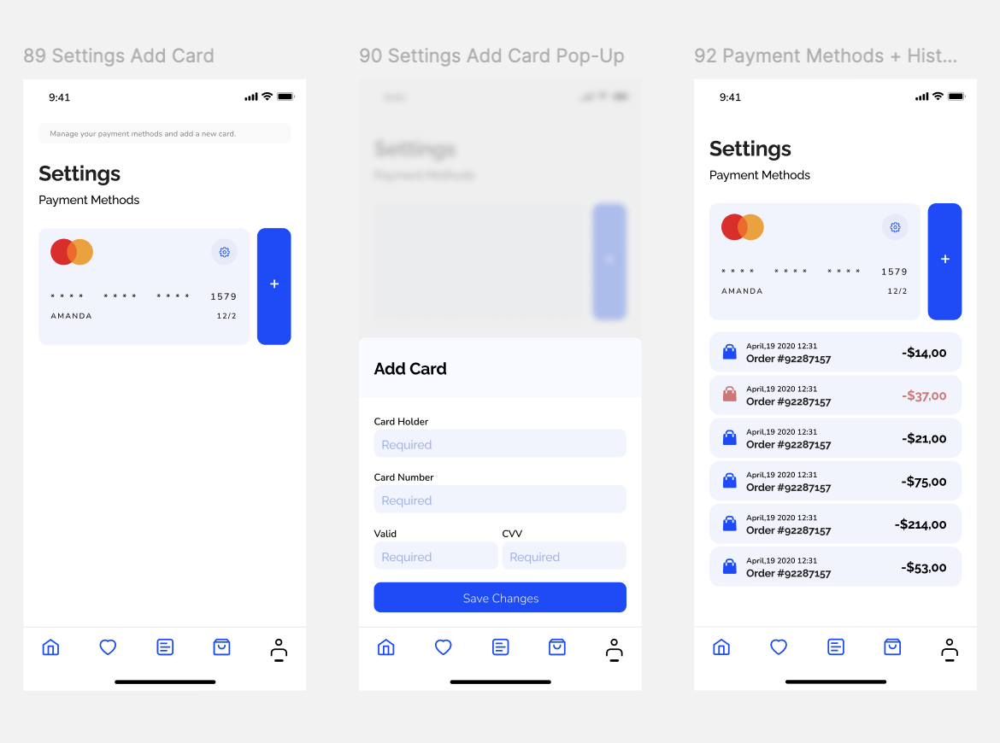
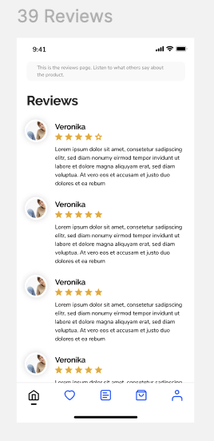

# 🛍️ Voida Shop – Accessibility-Focused UI/UX Design

This repository contains the UI/UX design of **Voida Shop**, a mobile shopping application tailored for **visually impaired users**.  
Our goal is to create a clean, accessible, and user-friendly interface that enables everyone to easily interact with online shopping platforms.

**Branch:** `hw_aliboev`  
**Tool:** Figma  
**Focus:** Accessibility, Minimalism, Inclusivity

---

Mana siz yuborgan eski README bo‘yicha **yangilangan versiyasi** — hozirgi holatga moslab yozilgan. Unda barcha tugagan sahifalar ko‘rsatilgan, faqat **delivery** va **history** sahifalari qolgan, shuningdek yangi sahifalarning skrinshotlari ham qo‘shilgan:

---

# 🛍️ Visually Impaired Shopping App

---

## ✅ Completed Pages

- **Login Page**
- **Create Account Page**   
  

- **Profile Page**  
  

- **Shop Page**  
  

- **Search Page**
- **Search Results Page**
- **Filter Page**  
  

- **Product Page**
- **Product Sale Page** 
  
   

- **Cart Page**
- **Add to Cart Options Page (Color & Size)**  
- **Payment Page**  
  
  

- **Reviews Page**  
  

---

## 🚧 In Progress

- **Delivery Page**
- **Order History Page**

---

## 📌 Notes

- Most core pages are completed and functional.
- Accessibility features (e.g. screen reader-friendly texts) are integrated in every page.
- Only **Delivery** and **Order History** pages are left to implement.
- Feedback and contributions are always welcome!

---

## 👤 Author

**Abbos Aliboev**  
Computer Science student Chungbuk National University  
Focusing on accessible technology and inclusive design

---

## 🔗 Our Figma Design Link

[Figma Design – Accessibility Login Page](https://www.figma.com/design/Ie71gRLhdyWucS0VDOREHh/Voida----Online-Store-UI-Mobile-App-Design?m=auto&t=eldecDiM1ZFkUBGd-6)

---
